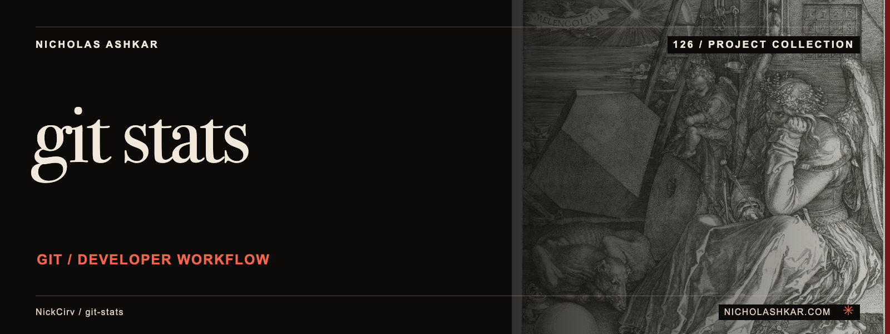

# git-stats

Render a local Git activity dashboard and contribution heatmap.


<a id="usage"></a>

## What it does

Summarizes commits by day, streak, time, contributor, message and file extension, with year/author/date filters. --team and --streaks select narrower views. See the pinned [implementation](https://github.com/NickCirv/git-stats/blob/4f9397d6afded4ea0eaf9d5e9087b66b82e8140e/index.js).


<a id="install"></a>

## Quickstart

Node requirement from the inspected manifest: **`>=20`**. Requires Git and a local repository with the relevant history. Commands are source-inspected, not executed in this review.

The following example is **source-inspected, not executed**. It uses a pinned checkout; npm package publication is not assumed. Replace project paths or provide the stated input fixtures before running it.

```bash
git clone https://github.com/NickCirv/git-stats.git
cd git-stats
git checkout 4f9397d6afded4ea0eaf9d5e9087b66b82e8140e
npm install --ignore-scripts
node index.js --heatmap
```

Dependencies are installed with lifecycle scripts disabled in this recipe. Read the package scripts before enabling any lifecycle step required by your environment.

## Usage and reference

`git-stats` are the executable names declared by the package. [Command reference](docs/REFERENCE.md) covers source-backed options and entry points.

| Control | Behavior in the inspected implementation |
| --- | --- |
| `--year YEAR` | Select a calendar year |
| `--author TEXT` | Filter an author |
| `--heatmap` | Show the calendar only |
| `--streaks` | Show streak calculations |
| `--team` | Show contributor statistics |

## Limits and operational notes

The language view is based on changed-file extensions rather than a complete source-language census. Commit timing and counts are not a measure of productivity or health.

## Development

No runtime checks were executed for this documentation review. The committed smoke test checks entrypoint JavaScript syntax; it does not exercise the command behavior.

| Script | Declared command |
| --- | --- |
| `test` | `node --test` |

Work from the pinned source, keep changes focused, and reproduce the affected behavior with a small fixture before proposing a change. Existing contribution and security policies remain authoritative where present.

## Research and status

[Research record](docs/RESEARCH.md) identifies the inspected revision, source evidence, documentation disposition and verification gaps. Static inspection supports the descriptions here; runtime behavior, dependency installation and current hosted services remain unverified.

## License and author

[License](https://github.com/NickCirv/git-stats/blob/4f9397d6afded4ea0eaf9d5e9087b66b82e8140e/LICENSE)

[Nicholas Ashkar](https://nicholashkar.com) · Applied AI, systems and consulting.
